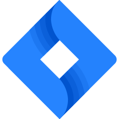

# Frontend Developer

### I always get excited about opportunities to work on innovative and challenging projects. Bold ideas motivate me to constantly develop my skills and stay up to date with modern technologies and best practices in frontend development.

 

## Tech Stack

> ### Programming and Markup Languages

<table width='100%'>
  <tr>
    <td align="center" width="140">
      
       JavaScript
    </td>
    <td align="center" width="140">
      
       TypeScript
    </td>
    <td align="center" width="140">
      
       CSS
    </td>
    <td align="center" width="140">
      
       HTML
    </td>
  </tr>
</table>

> ### Technologies and Frameworks

<table width='100%'>
  <tr>
    <td align="center" width="140">
      
       React
    </td>
    <td align="center" width="140">
      
       Angular
    </td>
    <td align="center" width="140">
      
       Redux
    </td>
    <td align="center" width="140">
      
       Next.js
    </td>
    <td align="center" width="140">
      
       RxJs
    </td>
    <td align="center" width="140">
      
       Cypress
    </td>
  </tr>

  <tr>
    <td align="center" width="140">
      
       Jest
    </td>
    <td align="center" width="140">
      
       Testing Library
    </td>
    <td align="center" width="140">
      
       GraphQl
    </td>
    <td align="center" width="140">
      
       Apollo
    </td>
    <td align="center" width="140">
      
       React Query
    </td>
  </tr>

   <tr>
    <td align="center" width="140">
      
       MUI
    </td>
    <td align="center" width="140">
      
       Tailwind
    </td>
    <td align="center" width="140">
      
       Bootstrap
    </td>
   <td align="center" width="140">
      
       Sass
    </td>
    <td align="center" width="140">
      
       BEM
    </td>
  </tr>
</table>

> ### Tools

<table width='100%'>
  <tr>
    <td align="center" width="130">
      
       Webpack
    </td>
    <td align="center" width="130">
      
       Vite
    </td>
    <td align="center" width="130">
      
       ESLint
    </td>
    <td align="center" width="130">
      
       Prettier
    </td>
    <td align="center" width="130">
      
       Gulp
    </td>
    <td align="center" width="130">
      
       Npm
    </td>
    <td align="center" width="130">
      
       Yarn
    </td>
  </tr>

  <tr>
    <td align="center" width="130">
      
       Git
    </td>
    <td align="center" width="130">
      
       GitHub
    </td>
    <td align="center" width="130">
      
       Figma
    </td>
    <td align="center" width="130">
      
       Jira
    </td>
    <td align="center" width="130">
      
       Netlify
    </td>
    <td align="center" width="130">
      
       VS Code
    </td>
  </tr>
</table>

 

## Contact me

 

> &nbsp;&nbsp; **Email:** spievakov@gmail.com

> 📞&nbsp;&nbsp; **Phone:** <a href="tel:+1647473-9502">+1 (647) 473-9502</a>

> &nbsp;&nbsp; **LinkedIn:** [https://www.linkedin.com/in/oleksandr-spievakov/](https://www.linkedin.com/in/oleksandr-spievakov-817a04253/)
